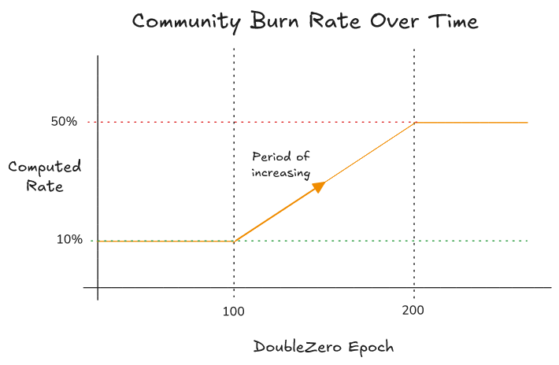
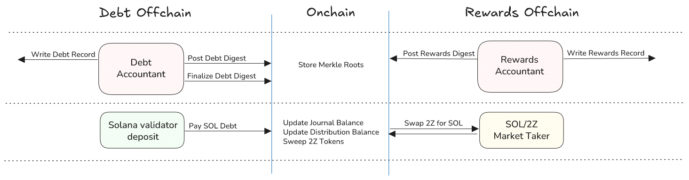
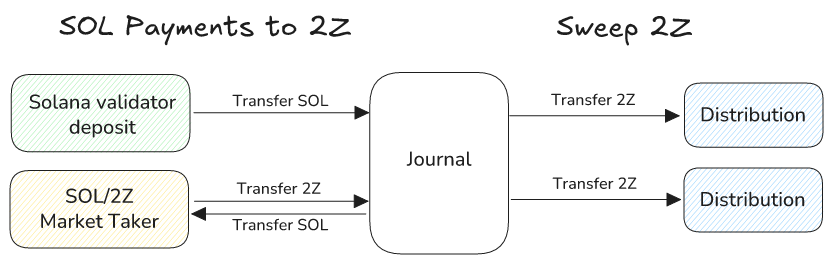
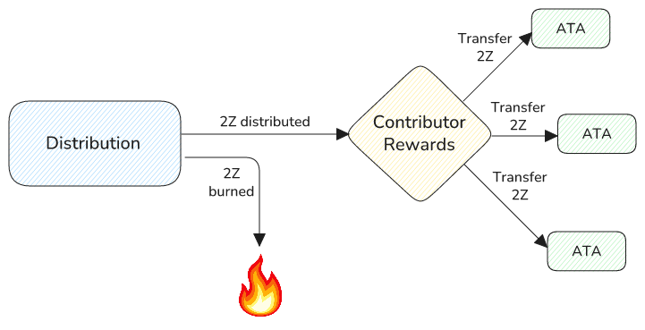

# Lifecycle of a Distribution

A distribution account represents the accounting of revenue moved from network
users to network contributors. The sum of the payments towards using the network
are split up among network contributors based on proportions calculated by how
much value each contributor provides to the network. A portion of rewards is
also burned.

## Core Components

There are three main components to this accounting: debt and rewards.

### Debt

Distribution debt is what some users owe to the system for a given DoubleZero
epoch. Currently, the only type of user that adds debt to the system is a Solana
validator.

Solana validator debt is calculated by revenue-share fee parameters, where
DoubleZero charges Solana validator network usage based on a portion of their
rewards. The specific portion is defined by these onchain parameters:

```rust
pub struct SolanaValidatorFeeParameters {
    /// Percentage of rewards from base transaction fees.
    pub base_block_rewards_pct: ValidatorFee,

    /// Percentage of rewards from priority transaction fees.
    pub priority_block_rewards_pct: ValidatorFee,

    /// Percentage of rewards from inflation.
    pub inflation_rewards_pct: ValidatorFee,

    /// Percentage of rewards from Jito tips.
    pub jito_tips_pct: ValidatorFee,

    /// Fixed amount of SOL charged to each validator. Maximum configurable
    /// amount is the bound of `u32::MAX`, so about 4.2 SOL.
    pub fixed_sol_amount: u32,
}
```

For example, if the fixed SOL amount parameter is 0.1 SOL and the base block
rewards percentage parameter is 5%, the total debt owed by a Solana validator
that earned 100 SOL in base block rewards is 5.1 SOL. What this means is the
system expects this Solana validator to pay 5.1 SOL towards this distribution.

Debt and payments satisfying this debt are tracked with the following variables
in a distribution:

```rust
pub struct Distribution {
    ..

    /// Digest of Solana validator debt data found in DoubleZero Ledger. 
    pub solana_validator_debt_merkle_root: Hash,

    /// Total number of Solana validators that incurred debt. This number
    /// also defines the size of the Merkle tree.
    pub total_solana_validators: u32,
    
    /// How many Solana validators have paid off their debt.
    pub solana_validator_payments_count: u32,
    
    /// Total amount of debt incurred by Solana validators.
    pub total_solana_validator_debt: u64,
    
    /// How much debt has been paid.
    pub collected_solana_validator_payments: u64,
    
    /// The amount of SOL that was owed in past distributions. The debt
    /// accountant controls this amount by forgiving debt from any
    /// earlier distribution to alleviate the system from carrying bad
    /// debt indefinitely.
    pub uncollectible_sol_debt: u64,
    
    ..
}
```

The Merkle root is the digest of all Solana validator debt for a particular
DoubleZero epoch. The data that this root represents lives in a record on the
DoubleZero Ledger network. Other variables are used to track more easily the
status of debt collection.

The Merkle root, total number of Solana validators and total debt are computed
offchain by a process called the Debt Accountant. This accountant is the only
authority that can submit data to update these fields. It computes debt by
fetching all of the types of rewards earned by each Solana validator on the
DoubleZero network. Please see [Meet the Accountants] for more information about
how this process works.

### Rewards

Distribution rewards are the 2Z tokens that are transferred to each of the
contributors' recipient token accounts. The specific recipients are defined in
the Contributor Rewards account.

Rewards calculated offchain are determined by computing Shapley values, which
determine how much utility each contributor provides to the DoubleZero network.
The sum of the values of all contributors determine how much proportion each
contributor deserves for a given epoch of rewards.

Network contributors do not collect all of the 2Z revenue, however. Some portion
of these rewards are burned either based on an algorithmic community burn rate
or offchain-calculated economic burn rate. At launch, only the community burn
rate applies. Later, an offchain economic burn rate will be introduced; the
higher of the two will be used. The burning mechanism will be discussed more
in [Distributing Rewards](#distributing-rewards).

Reward calculations are tracked with the following variables:

```rust
pub struct Distribution {
    ..
  
    /// Digest of rewards data found in DoubleZero Ledger.
    pub rewards_merkle_root: Hash,

    /// Total number of network contributors that earned rewards. This number
    /// also defines the size of the Merkle tree.
    pub total_contributors: u32,

    /// How many contributors have collected their reward distributions.
    pub distributed_rewards_count: u32,

    /// How many rewards have been distributed.
    pub distributed_2z_amount: u64,
    
    /// How many rewards have been burned.
    pub burned_2z_amount: u64,
    ..
}
```

The Merkle root is the digest of all network contributor reward proportions for
a particular DoubleZero epoch. The data that this root represents lives in a
record on the DoubleZero Ledger network. Other variables are used to track more
easily the status of reward distributions to the network contributors.

The Merkle root and total number of network contributors are computed offchain
by a process called the Rewards Accountant. This accountant is the only
authority that can submit data to update these fields. It computes reward
proportions by calculating the proportional utility each contributor provides to
the DoubleZero network. Please see [Meet the Accountants] for more information
about how this process works.

## Initializing a Distribution

When the DoubleZero Ledger network rolls into a new epoch, the Revenue
Distribution program needs to be synced with this epoch. A new distribution is a
representation of this epoch.

There are several state variables in this distribution account that the
initialization sets.

- DoubleZero epoch
- Community burn rate
- Solana validator fee parameters
- Distribute reward relay SOL amount
- Calculation allowed timestamp

DoubleZero epoch is tracked in a global account called the Program Config, which
is the source-of-truth for most program settings. Once the program establishes a
new distribution, this epoch value upticks.

**It is important to note that the program trusts that the Debt Accountant will
not create distributions reflecting future DoubleZero epochs.** Although there
is no consequence to having these future distributions exist, it may cause
confusion if anyone fetching information about the current DoubleZero epoch
reads this data on Solana.

The community burn rate is determined by a very simple algorithm, which is based
on a few parameters.



The community burn rate calculator will assign a rate to be used to burn a
portion of rewards up to a hard limit. So for example, if the community burn
rate is in the middle of the increasing phase between the initial rate of 10%
and 50% limit, this distribution will encode 30% as its community burn rate.
When rewards are distributed, contributors will earn only a maximum of 70% of
rewards. If there is no economic burn rate that exceeds 30%, contributors will
receive 70%.

Solana validator fee parameters are copied from the program config account to
take a snapshot of the configured fees. The Debt Accountant will use this fee
snapshot to calculate the debt owed for this distribution.

A relay fee (in terms of SOL) is an amount paid to whomever executes the
instruction that distributes rewards, which needs to be invoked for each network
contributor that qualifies for rewards for this distribution. It provides an
incentive for someone to act as a relayer on behalf of network contributors.

A timestamp is assigned to the distribution to indicate when the accountants are
allowed to submit data to this distribution. This period of time prevents the
accountant processes from jumping the gun at submitting Merkle roots too
quickly. An example of a bad scenario if this timestamp is too early is if the
rewards accountant did not give enough time for telemetry data to be recorded
for this epoch, which can impact the reward proportions it calculates.

## Performing Distribution Accounting

Once a distribution is initialized, two sets of operations run in parallel:
**Debt Accounting** and **Rewards Accounting**. Each process involves publishing
a Merkle root, verifying data, and eventually finalizing its part of the
distribution. Importantly, **neither accountant needs to wait on the other** —
they can submit and validate their data independently.

- The **Debt Accountant** focuses on Solana validator obligations, which allow
  payments to be processed and sweeping SOL into 2Z.
- The **Rewards Accountant** focuses on calculating contributor reward
  proportions.

Because these processes are independent, debt repayment and reward proportion
calculation can advance simultaneously. This concurrency reduces delays in
preparing a distribution: as soon as both sides are finalized (debt settled and
rewards data confirmed), the system can move on to the reward distribution
phase.

The diagram below illustrates this parallel flow.



### Calculating Debt

The **Debt Accountant** publishes Solana validator debt data, including the
Merkle root, total validator count, and total debt. After verifying this data,
the accountant finalizes the debt calculation. Once finalized, validators can
begin making payments, and 2Z tokens can be swept into the distribution.

Validators repay their debt through deposit accounts. The exact amount owed is
transferred in SOL from each deposit account to the system, with Merkle proofs
required to validate each payment.

The amount of 2Z swept into a distribution is proportional to the SOL debt
collected. When SOL is converted into 2Z, each swap is recorded in the external
**SOL/2Z Swap Program**, which enables actors to exchange SOL and 2Z. (See
[Conversion to 2Z from Other Currencies] for more details on this process.) The
system tracks the aggregate SOL collected across all distributions, and this
balance funds the conversions.

| **Action** | **Journal** | **Distribution** |
| ---------- | ----------- | ---------------- |
| Pay Solana validator debt | Increase SOL balance | Increase collected SOL |
| Buy SOL via SOL/2Z Swap   | Decrease SOL balance<br>Increase swapped SOL balance<br>Increase 2Z balance |  |
| Sweep | Decrease swapped SOL balance<br>Decrease 2Z balance | Increase 2Z balance |

Debt repayment and token sweeping can occur concurrently. As long as the system
holds enough SOL to satisfy the debt for a distribution, there will be
sufficient SOL available to convert into 2Z for that same distribution.



### Calculating Rewards

The **Rewards Accountant** publishes contributor reward proportions, including
the Merkle root and total contributor count. Rewards cannot be finalized
immediately — the program enforces a **deferral period** (measured in DoubleZero
epochs) before distribution is allowed. This delay gives the accountant time to
validate and correct the data before it becomes permanent.

For example, if the deferral period is 10 epochs and a distribution is created
for epoch 1, rewards cannot be distributed until epoch 11. Until then, the
Rewards Accountant may update or confirm the reward data for accuracy.

Once the deferral period passes, anyone can finalize the rewards calculation.
Finalization locks in the reward proportions and enables contributors to claim
their 2Z tokens.

## Distributing Rewards

Once a distribution has its contributor rewards digest and the corresponding 2Z
tokens swept into its account, it has everything needed to pay contributors.
After the deferral period ends, anyone can trigger reward distribution.

The reward proportions for each contributor are encoded in the digest.
Contributors can also configure how their share is split across specific
recipients. When rewards are distributed, each recipient’s token account
receives its portion based on these configurations. A portion of rewards,
however, is permanently burned.

The **burn rate** determines how much of the total reward pool is destroyed
before distribution. For launch, only the **community burn rate** applies. In
the future, the program can also incorporate an **economic burn rate**
calculated offchain. In that case, the effective burn rate will be whichever is
higher.

Burning reduces the total supply of 2Z and occurs automatically with every
distribution to each contributor.



[Auxiliary Accounts]: AUXILIARY_ACCOUNTS.md
[Conversion to 2Z from Other Currencies]: CONVERSION_TO_2Z.md
[Meet the Accountants]: MEET_THE_ACCOUNTANTS.md